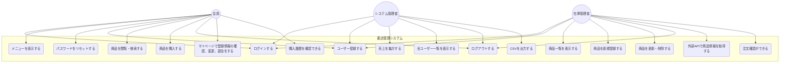

```mermaid
graph TD
    User((会員))
    Staff((在庫管理者))
    Master((システム管理者))

    subgraph System [書店管理システム]
        UC1(ログインする)
        UC2(メニューを表示する)
        UC3(パスワードをリセットする)
        UC4(ユーザー登録する)
        UC7(商品を閲覧・検索する)
        UC8(商品を購入する)
        UC11(商品一覧を表示する)
        UC12(売上を集計する)
        UC13(商品を新規登録する)
        UC14(商品を更新・削除する)
        UC15(全ユーザー一覧を表示する)
        UC16(ログアウトする)
        UC17(外部APIで商品情報を取得する)
        UC18(CSVを出力する)
        UC19(マイページで登録情報の確認、変更、退会をする)
        UC20(購入履歴を確認できる)
        UC21(注文確認ができる)
        
    end

    User --> UC1
    User --> UC2
    User --> UC3
    User --> UC4
    User --> UC7
    User --> UC8
    User --> UC16
    User  --> UC19
    User  --> UC20

    Staff --> UC1
    Staff --> UC4
    Staff --> UC11
    Staff --> UC13
    Staff --> UC14
    Staff --> UC16
    Staff --> UC17
    Staff --> UC21

    Master --> UC1
    Master --> UC4
    Master --> UC12
    Master --> UC15
    Master --> UC16
    Master --> UC18
```

