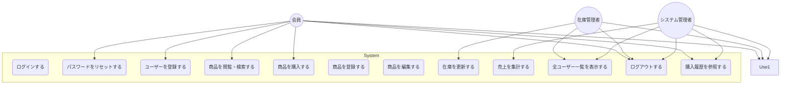

```mermaid
graph TD
    User((会員))
    Staff((在庫管理者))
    Master((システム管理者))

    subgraph System
        sUse1(ログインする)
        Use2(パスワードをリセットする)
        Use3(ユーザーを登録する)
        Use4(商品を閲覧・検索する)
        Use5(商品を購入する)
        Use6(商品を登録する)
        Use7(商品を編集する)
        Use8(在庫を更新する)
        Use9(売上を集計する)
        Use10(全ユーザー一覧を表示する)
        Use11(ログアウトする)
        Use12(購入履歴を参照する)
    end

    User --> Use1
    User --> Use2
    User --> Use3
    User --> Use4
    User --> Use5
    User --> Use11
    User --> Use12

    Staff --> Use1
    Staff --> Use8
    Staff --> Use10
    Staff --> Use11

    Master --> Use1
    Master --> Use9
    Master --> Use10
    Master --> Use11
    Master --> Use12
```

