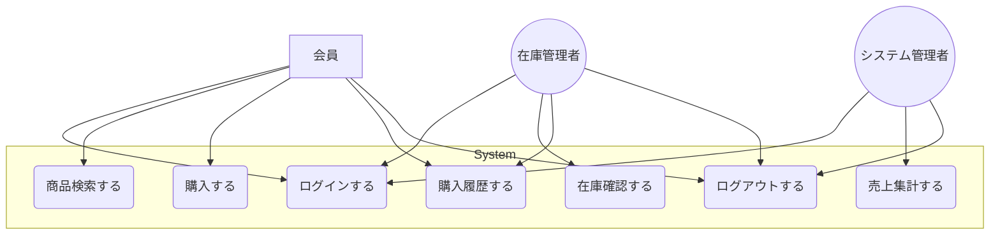

```mermaid
graph TD
    User[会員]
    Staff((在庫管理者))
    Master((システム管理者))

    subgraph System
        Use1(ログインする)
        Use2(商品検索する)
        Use3(購入する)
        Use4(在庫確認する)
        Use5(売上集計する)
        Use6(購入履歴する)
        Use7(ログアウトする)
    end

    User --> Use1
    User --> Use2
    User --> Use3
    User --> Use6
    User --> Use7

    Staff --> Use1
    Staff --> Use4
    Staff --> Use6
    Staff --> Use7

    Master --> Use1
    Master --> Use5
    Master --> Use7
```

