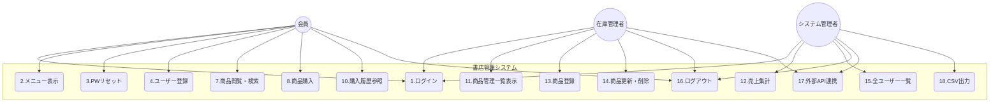

```mermaid
graph TD
    User((会員))
    Staff((在庫管理者))
    Master((システム管理者))

    subgraph System [書店管理システム]
        U1(1.ログイン)
        U2(2.メニュー表示)
        U3(3.PWリセット)
        U4(4.ユーザー登録)
        U7(7.商品閲覧・検索)
        U8(8.商品購入)
        U10(10.購入履歴参照)
        U11(11.商品管理一覧表示)
        U12(12.売上集計)
        U13(13.商品登録)
        U14(14.商品更新・削除)
        U15(15.全ユーザー一覧)
        U16(16.ログアウト)
        U17(17.外部API連携)
        U18(18.CSV出力)
    end

    User --> U1
    User --> U2
    User --> U3
    User --> U4
    User --> U7
    User --> U8
    User --> U10
    User --> U16

    Staff --> U1
    Staff --> U11
    Staff --> U13
    Staff --> U14
    Staff --> U16
    Staff --> U17

    Master --> U1
    Master --> U12
    Master --> U15
    Master --> U16
    Master --> U17
    Master --> U18
```

