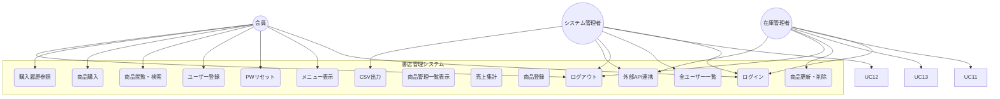

```mermaid
graph TD
    User((会員))
    Staff((在庫管理者))
    Master((システム管理者))

    subgraph System [書店管理システム]
        UC1(ログイン)
        UC2(メニュー表示)
        UC3(PWリセット)
        UC4(ユーザー登録)
        UC7(商品閲覧・検索)
        UC8(商品購入)
        UC10(購入履歴参照)
        U11(商品管理一覧表示)
        U12(売上集計)
        U13(商品登録)
        UC14(商品更新・削除)
        UC15(全ユーザー一覧)
        UC16(ログアウト)
        UC17(外部API連携)
        UC18(CSV出力)
    end

    User --> UC1
    User --> UC2
    User --> UC3
    User --> UC4
    User --> UC7
    User --> UC8
    User --> UC10
    User --> UC16

    Staff --> UC1
    Staff --> UC11
    Staff --> UC13
    Staff --> UC14
    Staff --> UC16
    Staff --> UC17

    Master --> UC1
    Master --> UC12
    Master --> UC15
    Master --> UC16
    Master --> UC17
    Master --> UC18
```

