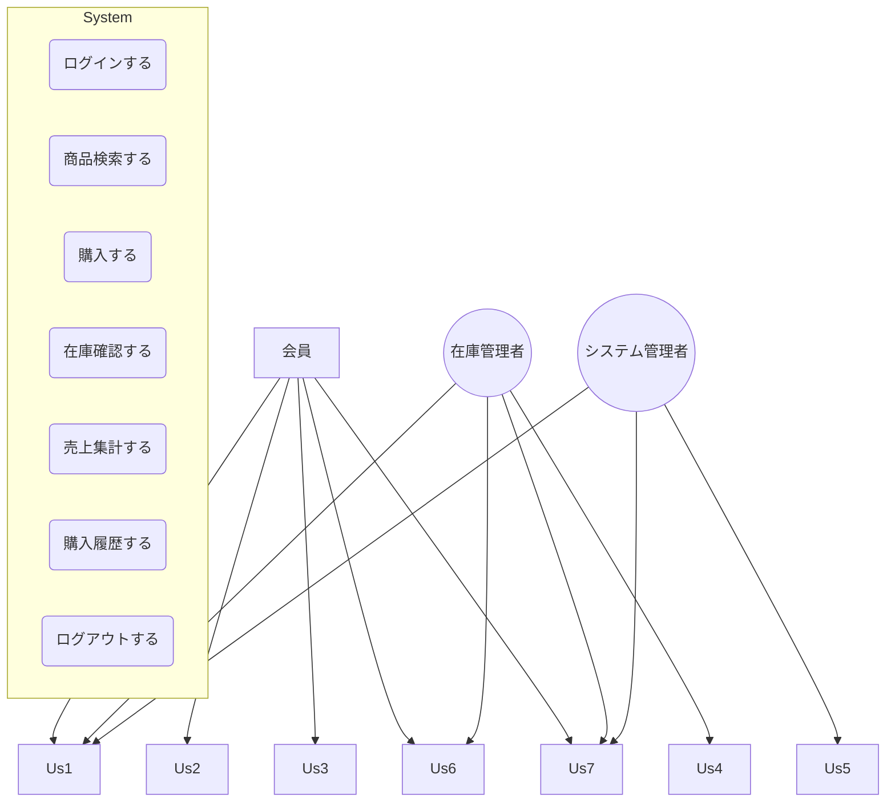

```mermaid
graph TD
    User[会員]
    Staff((在庫管理者))
    Master((システム管理者))

    subgraph System
        Use1(ログインする)
        Use2(商品検索する)
        Use3(購入する)
        Use4(在庫確認する)
        Use5(売上集計する)
        Use6(購入履歴する)
        Use7(ログアウトする)
    end

    User --> Us1
    User --> Us2
    User --> Us3
    User --> Us6
    User --> Us7

    Staff --> Us1
    Staff --> Us4
    Staff --> Us6
    Staff --> Us7

    Master --> Us1
    Master --> Us5
    Master --> Us7
```

