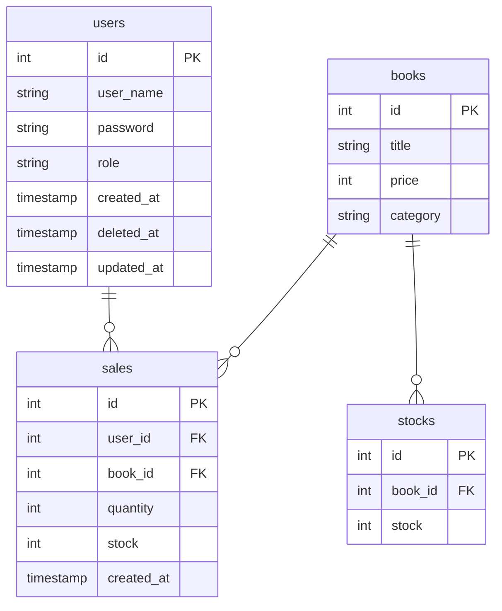

```mermaid
erDiagram
    users ||--o{ sales : ""
    books ||--o{ stocks : ""
    books ||--o{ sales : ""

    users {
        int id PK
        string user_name
        string password
        string role
        timestamp created_at
        timestamp deleted_at
        timestamp updated_at
    }

    books {
        int id PK
        string title
        int price
        string category
    }

    stocks {
        int id PK
        int book_id FK
        int stock
    }

    sales {
        int id PK
        int user_id FK
        int book_id FK
        int quantity
        int stock
        timestamp created_at
    }
```